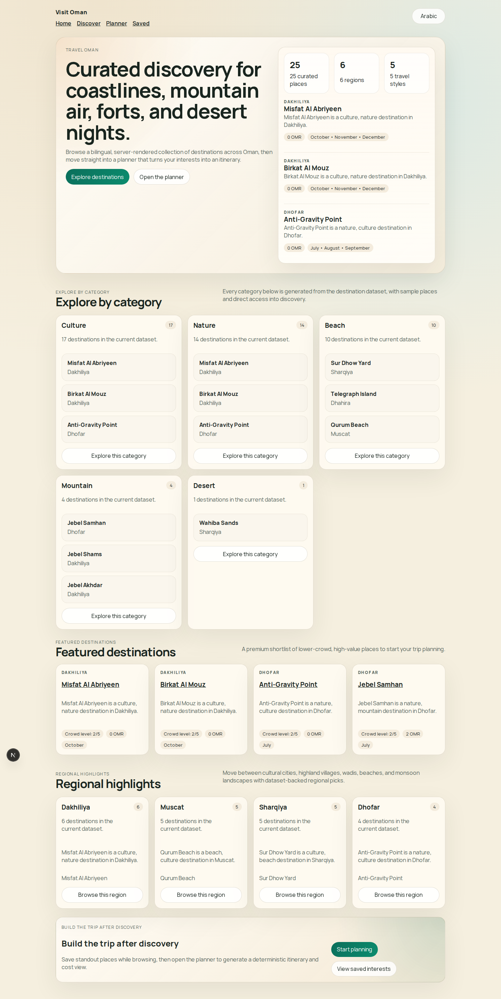
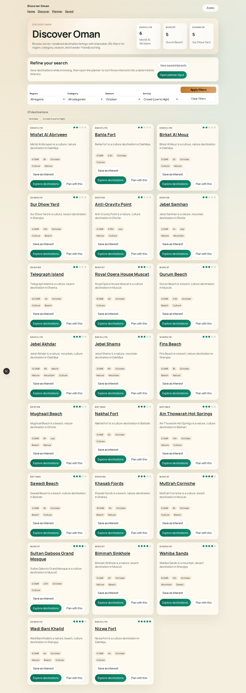
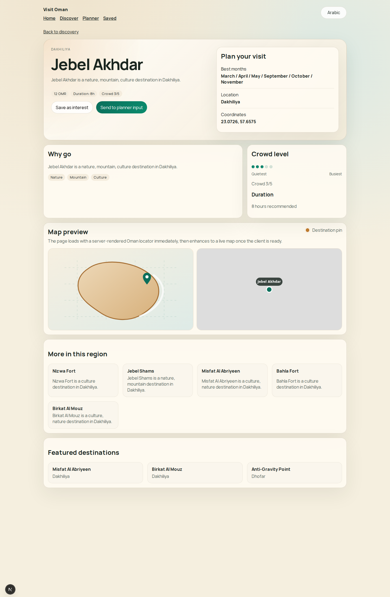
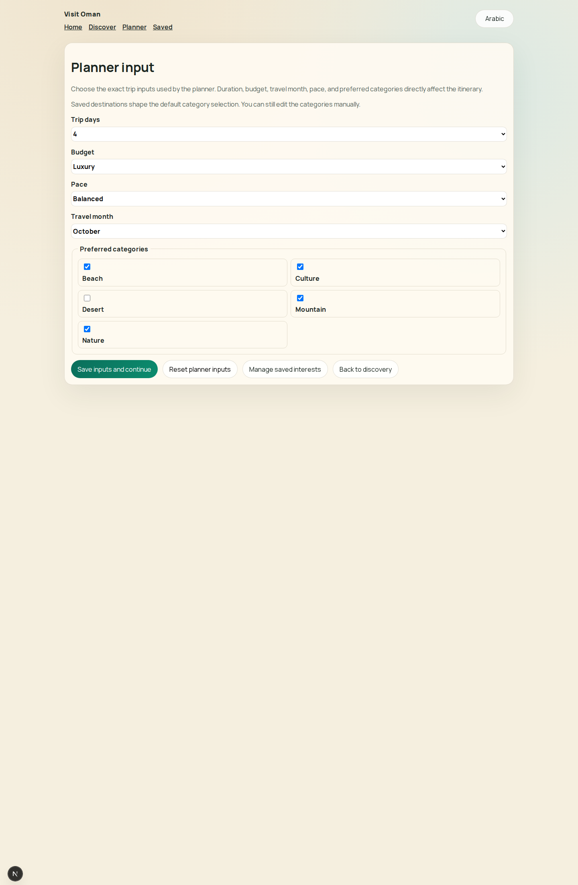
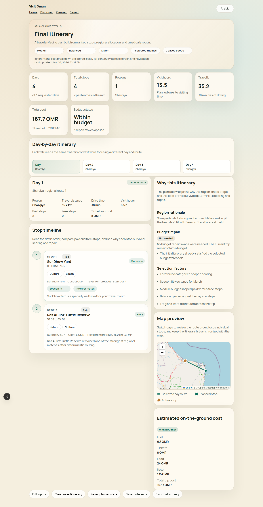
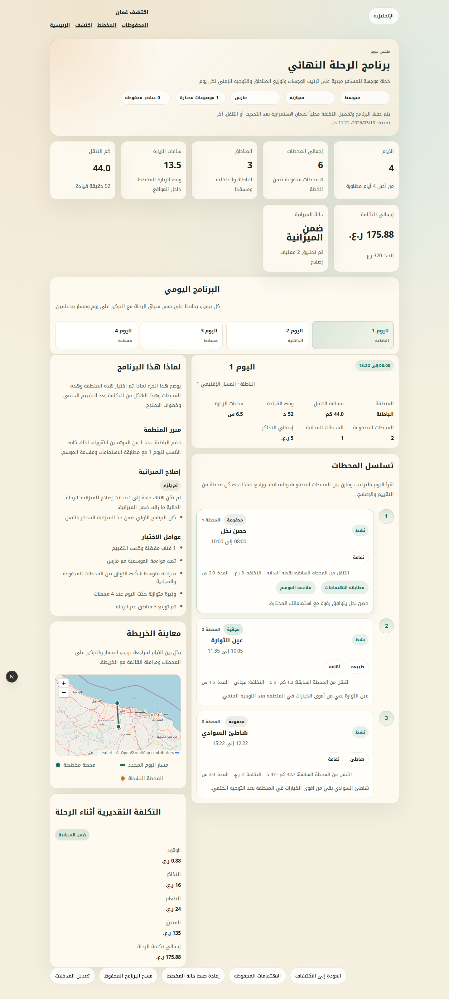

# Visit Oman Frontend

**CodeStacker 2026 — Frontend Challenge Submission**

Visit Oman is a bilingual Next.js App Router experience that turns a fixed Oman destination dataset into an end-to-end traveler journey: SSR discovery, saved-interest collection, deterministic itinerary generation with weighted scoring, route optimization, budget-aware repair, and a traveler-facing result page with maps, costs, and explanations.

The app ships with `challenge-dataset.v3`, uses 25 in-repo destinations only, and keeps the planner deterministic for identical inputs.

## Why This Submission Fits The Brief

- **Dataset-only discovery**: all destination content comes from the bundled dataset. No external content APIs.
- **SSR + CSR architecture**: discovery and detail pages are server-rendered and crawlable; planner and result pages are client-rendered for browser-state continuity.
- **Deterministic browser-only planner**: fixed weights, fixed beam width, stable slug tie-breakers, no randomness, no external ranking or routing APIs.
- **Bilingual support**: English (`/en`) and Arabic (`/ar`) routes with RTL layout and localized labels.
- **Local persistence**: interests, planner draft, itinerary, and cost breakdowns survive page refresh via versioned `localStorage` keys.
- **Route map + explanations + cost output**: the result page renders daily stops with start/end times, travel distances, scoring reasons, a Leaflet map with polylines, and a full cost breakdown.

## Product Journey

### 1. Home / Discovery / Detail

- `src/app/[locale]/page.tsx` — SSR landing with featured regions and category spotlights
- `src/app/[locale]/discover/page.tsx` — SSR discovery page with dataset-driven filters
- `src/app/[locale]/discover/[slug]/page.tsx` — SSR detail page with map preview, gallery, and save action

### 2. Save Interests

- `src/components/save-interest-button.tsx` — toggle button on detail and discovery cards
- `src/app/[locale]/saved/page.tsx` — CSR page listing all saved destinations
- `src/lib/persistence/interests.ts` — versioned `localStorage` under `visit-oman.interests.v1`

### 3. Planner Form

- `src/app/[locale]/planner/page.tsx` — CSR planner page
- `src/components/planner-form.tsx` — form pre-populated from saved interests and draft

Captures:
- preferred categories (derived from saved interests)
- trip duration: `1..7` days
- travel intensity: `relaxed | balanced | packed`
- budget: `low | medium | luxury`
- travel month: `1..12`

### 4. Planner Result

- `src/app/[locale]/planner/result/page.tsx` — CSR result page

Runs the full planner pipeline in the browser, persists the itinerary, computes cost breakdowns, and renders the final plan with a client-only Leaflet map.

### 5. Arabic Parity

All flows work identically on `/ar/*` with RTL layout, Arabic labels, and localized month/budget/category names.

## Architecture

### App Routes

| Route | Rendering | Purpose |
| --- | --- | --- |
| `/[locale]` | SSR (SSG) | Landing page |
| `/[locale]/discover` | SSR (dynamic) | Discovery with filters |
| `/[locale]/discover/[slug]` | SSR (SSG) | Destination detail |
| `/[locale]/planner` | CSR | Planner form |
| `/[locale]/planner/result` | CSR | Itinerary result |
| `/[locale]/saved` | CSR | Saved interests |

### Data Layer

- `src/data/challenge-dataset.ts` — source of truth (25 destinations)
- `src/lib/data/load-destinations.ts` — dataset loading and version tagging
- `src/lib/data/normalize-destinations.ts` — locale-aware domain normalization
- `src/lib/data/selectors.ts` — SSR discovery selectors

### Planner Pipeline

- `src/lib/planner/scoring-primitives.ts` — six normalized scoring functions
- `src/lib/planner/weighted-scoring-engine.ts` — weighted multi-objective scorer
- `src/lib/planner/candidate-ranking.ts` — greedy iterative candidate selection
- `src/lib/planner/region-allocation.ts` — bounded-search region allocation
- `src/lib/planner/intra-region-routing.ts` — beam search + 2-opt routing
- `src/lib/planner/final-itinerary.ts` — timed itinerary assembly
- `src/lib/planner/itinerary-repair.ts` — budget repair + underutilized-day fill
- `src/lib/planner/cost-model.ts` — trip cost calculation

### Persistence

- `src/lib/persistence/interests.ts` — saved destination slugs
- `src/lib/persistence/planner-draft.ts` — form state
- `src/lib/persistence/itinerary.ts` — itinerary + cost breakdown
- `src/lib/persistence/keys.ts` — versioned key constants

### i18n

- `src/lib/i18n/config.ts` — locale resolution
- `src/lib/i18n/messages/en.json`, `ar.json` — translated labels
- `src/middleware.ts` — locale-aware routing

### Maps

- `src/components/maps/itinerary-map.client.tsx` — result page Leaflet map
- `src/components/maps/destination-preview-hydrated.client.tsx` — detail page interactive map
- `src/components/maps/map-config.ts` — tile layer configuration

## Rendering Boundaries

### SSR

- `/[locale]`, `/[locale]/discover`, `/[locale]/discover/[slug]`
- Server components. Ideal for first-load performance, crawlability, and static dataset rendering.
- `generateStaticParams` produces all 50 locale+slug paths at build time.

### CSR

- `/[locale]/planner`, `/[locale]/planner/result`, `/[locale]/saved`
- Depend on `localStorage` and traveler-specific state.
- The Leaflet map is dynamically imported with `ssr: false` to avoid server-side DOM access.

## Dataset Contract

- Source: `src/data/challenge-dataset.ts`
- Version: `challenge-dataset.v3`
- Destination count: `25`
- Raw type: `src/types/dataset.ts` (`DatasetDestination`)
- Normalized type: `src/types/domain.ts` (`Destination`)

Region keys in the dataset: `muscat`, `dakhiliya`, `sharqiya`, `dhofar`, `batinah`, `musandam`.

Normalization adds: `coordinates`, `description`, `budgetLevel`, `recommendedDurationHours`, `regionKey`, `regionLabel`, `locale`. This keeps discovery and planner code reading a single normalized shape.

## Exact Scoring Formula

Source: `src/lib/planner/weighted-scoring-engine.ts` (config version `vo-p3-v1`)

```text
totalScore =
  + 0.34 × interestMatch
  + 0.18 × seasonFit
  - 0.10 × normCrowd
  - 0.14 × normCost
  - 0.12 × detourPenalty
  + 0.12 × diversityGain
```

### Primitive Definitions

| Primitive | Formula | Source |
| --- | --- | --- |
| `interestMatch` | Jaccard: `\|preferred ∩ destination\| / \|preferred ∪ destination\|` | `scoring-primitives.ts` |
| `seasonFit` | `1` if month recommended; else `1 - circularMonthDistance / 6` | `scoring-primitives.ts` |
| `normCrowd` | `(crowdLevel - 1) / 4` | `scoring-utils.ts` |
| `normCost` | `(ticketCost - minCost) / (maxCost - minCost)` | `scoring-utils.ts` |
| `detourPenalty` | `bestInsertionCostKm / (maxPairwiseDistanceKm × 2)` | `scoring-primitives.ts` |
| `diversityGain` | fraction of destination categories not yet in selected set | `scoring-primitives.ts` |

All primitives clamped to `[0, 1]`. Penalty metrics (`normCrowd`, `normCost`, `detourPenalty`) are subtracted. Benefit metrics (`interestMatch`, `seasonFit`, `diversityGain`) are added.

Precision: deterministic rounding to 6 decimal places. Tie-breaker: destination slug (lexicographic).

### Candidate Selection

Source: `src/lib/planner/candidate-ranking.ts` (config version `phase-4c-v2`)

Greedy iterative: each round scores all remaining candidates against the current selected set, picks the top one, and repeats.

Target count: `clamp(round(tripDays × paceMultiplier), 3, 10)` where pace multipliers are `relaxed=1`, `balanced=1.25`, `packed=1.5`.

Minimum viable score: `0.4`. Candidates below this threshold are excluded regardless of rank.

## Region Allocation

Source: `src/lib/planner/region-allocation.ts` (config version `phase-5a-v3`)

### Region utility

```text
regionUtility =
  0.50 × averageCandidateScore
  + 0.20 × destinationDensity
  + 0.20 × regionSeasonFit
  + 0.10 × diversityBonus
```

### Constraints

- Maximum days per region: `ceil(tripDays / 2)`
- Minimum regions: `2` when `tripDays ≥ 3` and viable region count ≥ 2; otherwise `1`
- Viable region threshold: `regionUtility ≥ 0.35`

### Bounded search

The allocator generates all feasible combinations of region sets, day compositions (integer partitions with each slot in `[1, maxPerRegion]`), and region orderings. Each allocation is scored with:

```text
score = weightedUtility + coverageBonus×0.04 + balanceBonus×0.03
        - poorSeasonExposure×0.18 - transitionPenalty×0.04
```

The highest-scoring allocation produces **contiguous day blocks** (e.g., Region A: days 1–3, Region B: days 4–5).

Fallback: if no valid allocation is found, all days go to the single highest-utility region.

## Routing and Scheduling

Source: `src/lib/planner/intra-region-routing.ts` (config version `phase-5b-v3`)

### Beam search

- Beam width: `4`
- Distance metric: Haversine (Earth radius 6371 km) via symmetric N×N distance matrix
- Travel speed: `55 km/h`
- Comparison: longer route > higher total score > lower distance > lexicographic signature

### 2-opt refinement

Applied when route has > 3 stops. Iterates segment reversals, accepting only valid improvements > 1e-9 km.

### Hard constraints

| Constraint | Value | Enforcement |
| --- | --- | --- |
| Day window | 08:00–20:00 | Operating window check |
| Max daily driving | 250 km | Cumulative distance check |
| Max daily visit time | 8 hours (480 min) | Cumulative visit check |
| Stop cap (relaxed) | 3 | Count check |
| Stop cap (balanced) | 4 | Count check |
| Stop cap (packed) | 5 | Count check |
| Same-region day | all stops same region | Region comparison |
| Category repetition | max 2 per category/day | Counter check |
| Rest-gap rule | no two consecutive long stops (> 90 min) | Adjacency check |
| Min visit duration | 30 minutes | Floor applied |

All constraints are validated on every beam expansion and every 2-opt swap.

### Timestamp computation

Starting from 08:00, each stop adds travel time (`max(5, round(distanceKm / 55 × 60))` minutes) then visit time (`max(30, round(recommendedDurationHours × 60))` minutes). Start and end times are computed as `HH:MM` labels.

## Cost Model

Source: `src/lib/planner/cost-model.ts`

| Item | Value |
| --- | --- |
| Fuel price | 0.24 OMR/liter |
| Vehicle efficiency | 12 km/liter |
| Food | 6 OMR/day |
| Hotel/night (low) | 20 OMR |
| Hotel/night (medium) | 45 OMR |
| Hotel/night (luxury) | 90 OMR |
| Budget threshold/day (low) | 45 OMR |
| Budget threshold/day (medium) | 80 OMR |
| Budget threshold/day (luxury) | 140 OMR |

```text
fuel     = (totalKm / 12) × 0.24
food     = 6 × tripDays
hotel    = nightlyRate[budget] × max(tripDays - 1, 0)
tickets  = sum(stop.ticketCostOmr)
total    = fuel + food + hotel + tickets
threshold = budgetThresholdPerDay[budget] × tripDays
withinBudget = total ≤ threshold
```

## Budget Repair

Source: `src/lib/planner/itinerary-repair.ts`

### Budget swap

Triggered when `totalCostOmr > budgetThresholdPerDay[budget] × tripDays`.

The repair loop ranks scheduled stops by value-for-cost (lowest first), then swaps each for a cheaper same-region alternative that preserves category coverage. Alternatives are sorted by: free destinations first, then lowest cost, then highest category overlap, then lowest detour, then highest score. Invalid swaps are reverted.

### Underutilized-day fill

Triggered when a day has < 4.8 hours of visits (60% of the 8-hour target). Fills with the nearest same-region unscheduled stop, respecting the budget threshold.

## Persistence

Source: `src/lib/persistence/*`

| Key | Purpose |
| --- | --- |
| `visit-oman.interests.v1` | Saved destination slugs |
| `visit-oman.planner-draft.v1` | Planner form state |
| `visit-oman.itinerary.v1` | Generated itinerary |
| `visit-oman.cost-breakdown.v1` | Cost breakdown (migrates v1 → v2) |
| `visit-oman.locale.v1` | Selected locale |

All keys survive page refresh. Legacy cost payloads are migrated to schema version 2 on read.

## Accessibility and Bilingual Support

- Locale routes: `/en/*` and `/ar/*`
- RTL layout for Arabic via `dir="rtl"` on the HTML element
- Localized labels: `src/lib/i18n/messages/en.json` and `ar.json`
- Translated: discovery filters, month names, budget labels, category labels, result explanations
- Semantic controls: links, buttons, labels, select inputs
- Keyboard-reachable day switching in the result view

## Performance and Determinism

**Performance**: all destination content is local; SSR for first paint and crawlability; planner logic is pure TypeScript; map is client-only and excluded from SSR.

**Determinism**: fixed weights, fixed beam width (4), fixed travel speed (55 km/h), stable slug tie-breakers, no remote APIs, no randomization. The only non-deterministic values are persistence timestamps (`savedAt`), which do not affect itinerary generation.

## Tests and Verification

### Automated tests

46 unit tests in `tests/planner.test.ts` covering:

- All 6 scoring primitives (`interestMatch`, `seasonFit`, `normCrowd`, `normCost`, `detourPenalty`, `diversityGain`)
- Weighted scoring engine (deterministic rounding, penalty direction, identical-input reproducibility, default weights)
- Route constraints (max daily visit hours, intensity stop caps, same-region rule, category repetition, rest-gap rule, max daily driving km, operating window)
- Cost model constants (fuel, food, hotel rates, budget thresholds, formulas)
- Region allocation rules (max per region, minimum regions, viable threshold)
- Determinism snapshot (same inputs produce same scores across runs)

### Verification commands

```bash
npm run verify    # runs typecheck + lint + test + build
```

Individual commands:

```bash
npm run typecheck  # tsc --noEmit
npm run lint       # eslint . --max-warnings=0
npm run test       # vitest run (46 tests)
npm run build      # next build
```

## Run Instructions

```bash
npm install
npm run dev
```

Open `http://localhost:3000/en` or `http://localhost:3000/ar`.

### Manual smoke flow

1. `/en/discover` — filters destinations server-side
2. Save a few destinations from discovery or detail pages
3. `/en/planner` — opens with pre-populated defaults from saved interests
4. Submit the planner form
5. `/en/planner/result` — shows generated itinerary, costs, map, and explanations
6. Refresh the result page — itinerary persists
7. Repeat on `/ar`

## Tradeoffs

- **Client-side generation**: the planner runs in the browser to preserve `localStorage` continuity. This means the result page is not server-rendered, but it keeps the flow seamless without a backend.
- **Haversine distance**: great-circle distance is used instead of road routing APIs. This keeps the app offline and deterministic, but actual driving paths will differ.
- **Budget repair scope**: repair uses fast deterministic swaps rather than global re-optimization. This trades theoretical optimality for predictable bounded behavior.
- **Bounded search exhaustiveness**: region allocation evaluates all feasible combinations, which is tractable for ≤ 7 days and ≤ 6 regions but would need pruning for larger problem sizes.

## Screenshots

### Home — `/en`


### Discovery — `/en/discover`


### Detail — `/en/discover/[slug]`


### Planner Form — `/en/planner`


### Result (English) — `/en/planner/result`


### Result (Arabic) — `/ar/planner/result`


## Supporting Documentation

- [Algorithm](docs/ALGORITHM.md) — full planner pipeline description matching the current implementation
- [Requirements Traceability](docs/REQUIREMENTS_TRACEABILITY.md) — challenge requirement audit with status, source files, and verification notes
- [Submission Checklist](docs/SUBMISSION_CHECKLIST.md) — final release checklist
